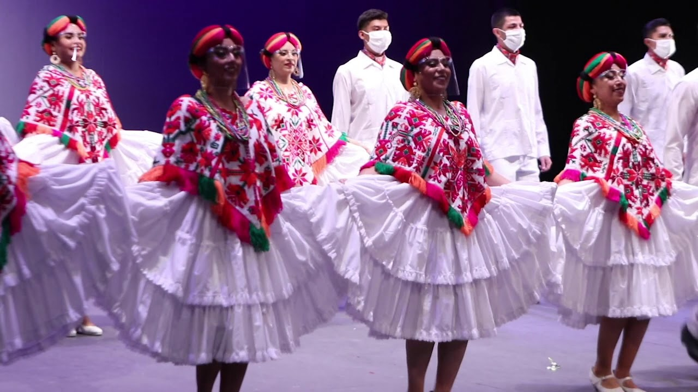

<h1 align="center"> Proyecto Final Big Data:Proyecto de Teachable Machine </h1>

## Índice
1. [Introducción](#introducción)
2. [Explicación del proyecto](#Explicacion)
3. [Instrucciones](#Instrucciones)
4. [Link Video](#Link_Video)

## Introducción
En este proyecto realizamos un modelo con Teachable Machine, en mi caso, de danza Folklorica que te dice, al elegir la región, si estas haciendo correctamente el paso o no

## Explicación
Este modelo serviría para el momento de estar en casa realizando los ensayos o bien cuando un maestro no pueda estar haciendo las correcciones pertinentes con respecto a la postura del baile que se está efectuando, lo que llevaría a un aprendizaje de manera autónoma y sencilla. 

## Instrucciones
1. `Paso`: Descargamos la carpeta que dice bailes en el apartado de arriba donde 
2. `Paso`: Abrimos esta carpeta en Visual Studio Code
3. `Paso`: En el lado izquierdo de la pantalla, en el area donde sale todo lo que esta en nuestra carpeta, dar click derecho en index y seleccionar la opcion de Open with Live Sever. Con esto se abrira el proyecto en el navegador.
4. `Paso`: Que se ponga la pagina, dar permiso de usar la camara, seleccionar el estado o region de la cual se evaluara el baile y activar la camara en el boton correspondiente.
5. `Paso`: Alejarse para verse completo de las rodillas a la cabeza y hacer la pose correspondiente a la seleccion.

6. Opcional: si se quiere probar utilizar esta como ejemplos de pose a realizar:
   Haupangos_v
   

   
   

   o buscar una de las demas regiones que se encuentran en el modelo

## Link Video

